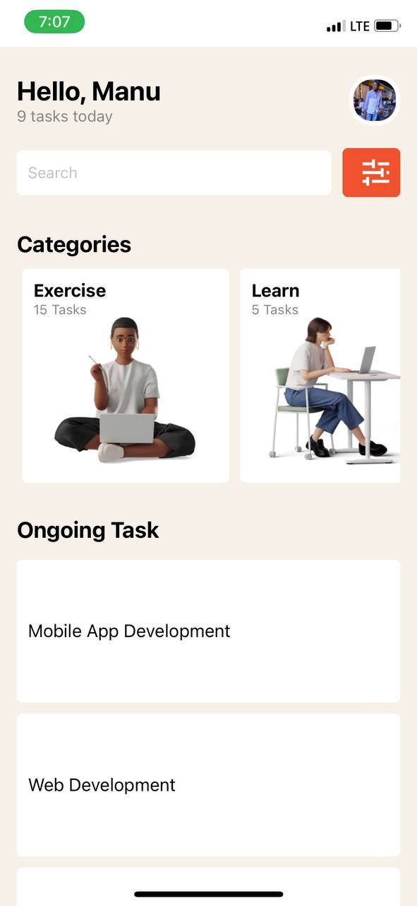

# Mobile Application Development - Task Manager

This is a mobile application developed for DCIT202 Assignment 3. The application is a simple task manager that includes various features and components to manage and track tasks across different categories.

## Table of Contents

- [Description](#description)
- [Components](#components)
- [Screenshot](#screenshot)
- [Usage](#usage)

## Description

The application utilizes several core components of React Native such as View, Text, ScrollView, TextInput, FlatList, Image, Button, and custom components to create a user-friendly interface for task management.

## Components

### App.js

The main file that integrates all components and displays the primary structure of the app.

- **Header**: Displays a greeting message and the number of tasks for the day.
- **CategoryCard**: Shows different task categories with the number of tasks and an image.
- **TaskItem**: Lists the ongoing tasks with task names.

### Header.js

Custom component for displaying the header section of the app.

- **View**: Contains the header layout.
- **Text**: Displays the title and subtitle.
- **Image**: Shows the user's profile image.

### CategoryCard.js

Custom component for displaying each category card.

- **View**: Contains the card layout.
- **Text**: Shows the category name and task count.
- **Image**: Displays the category image.

### TaskItem.js

Custom component for displaying individual task items.

- **View**: Contains the task item layout.
- **Text**: Displays the task name.

## Screenshot



## Usage

1. Clone the repository:

   ````bash
   git clone https://github.com/ManuSuper1/rn-assignment3-ID-11137211.git```

   ````

2. Installations

````cd rn-assignment3-ID-11137211
npm install```
3. Run
``` npm run android or npm run ios ```
````
